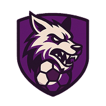
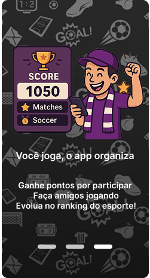
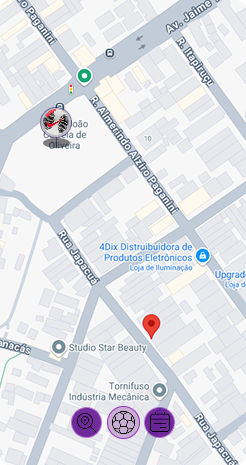

Perfeito! Como você criou a pasta `kick-imgs` e organizou as imagens localmente no seu repositório, aqui está o **README estilizado e ajustado** com os caminhos relativos corretos:

---

# KickOff – Jogue, Conecte, Evolua!

**KickOff** é um aplicativo mobile que conecta pessoas para jogar futebol amador. Organize seus rachões, encontre partidas próximas e participe da comunidade futebolística local — tudo com poucos cliques!

---

##  Visão Geral

---

## 🗺️ Mapa e Funcionalidades

Visualize locais, marque jogos e explore equipes e campos próximos com o mapa interativo integrado:

---

##  Funcionalidades Principais

*  Marque partidas de forma rápida e intuitiva
*  Crie ou junte-se a equipes locais
*  Sistema de pontos e ranking por participação
*  Localização geográfica de jogos e jogadores
*  Organização de eventos e treinos

---

## 🏅 Gamificação no Futebol

Com nosso sistema de pontuação, você ganha recompensas por:

* Participar de jogos
* Confirmar presença
* Manter frequência
* Convidar amigos

> *"Você joga, o app organiza."*
> *"Evolua no ranking do esporte!"*

---

## 📸 Capturas de Tela

| Tela Inicial                                                 | Explicação                                               | Mapa Interativo                                            |
| ------------------------------------------------------------ | -------------------------------------------------------- | ---------------------------------------------------------- |
|  |  |  |

---
